## Introduction

This project is written in C# with the .NET Framework 4.5. It is intended for developers who want to add SAML2 authentication to their ASP.NET MVC web application. This documentation will explain how to configure Cloud Federation Service (CFS) to authenticate users for this web application. This project uses the ITfoxtec package (https://github.com/ITfoxtec/ITfoxtec.SAML2).

## Configure CFS
First, login as a Tenant Administrator in CFS and create a new SAML2 Generic application.

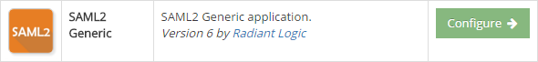

In the _General_ tab, enable your application and provide a name.

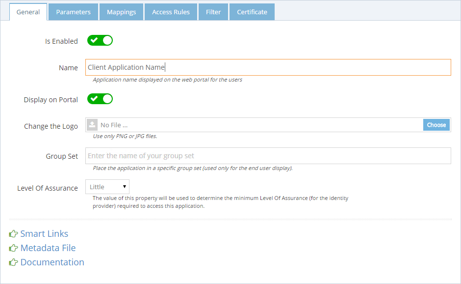

In the _Parameters_ tab, enter the address of your CFS in the **Issuer** field and the address of your client application in the **Audience** field. The audience parameter verifies that the application is the intended recipient of the SAML response.

The **Recipient** field should be the address of your application endpoint where CFS send the SAML token response once authenticated.
> https://<WEB_APP_ADDRESS>/Home/AssertionConsumerService

The **Logout Endpoint** field should be the address of your application endpoint which signal the single logout.
> https://<WEB_APP_ADDRESS>/Home/LoggedOut

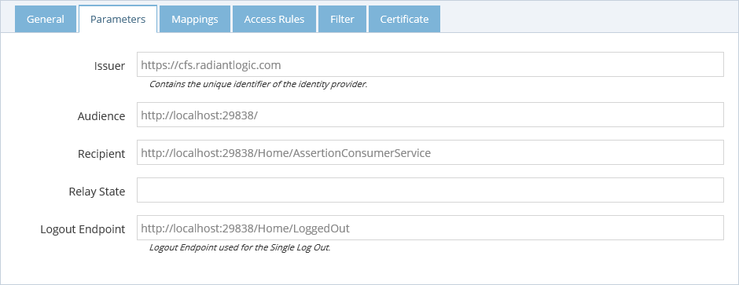

In the _Mappings_ tab, enter the list of claims you want to send to your web application. In the example bellow I will send the email address from VDS as the name identifier.

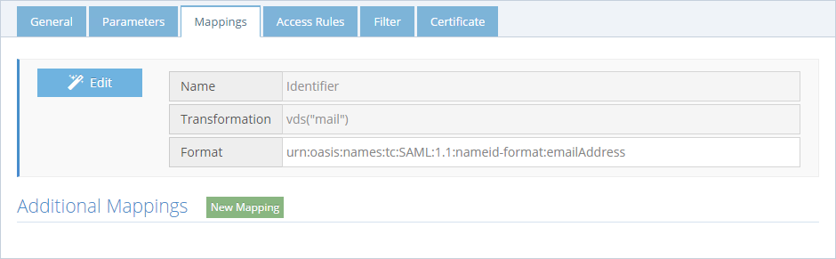

In the _Access Rules_ tab, allow the application to anyone for testing purpose and save the configuration.

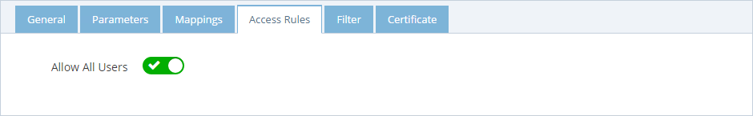

On the _General_ tab, open the Metadata File. The information inside will be used to configure the Client Web Application.

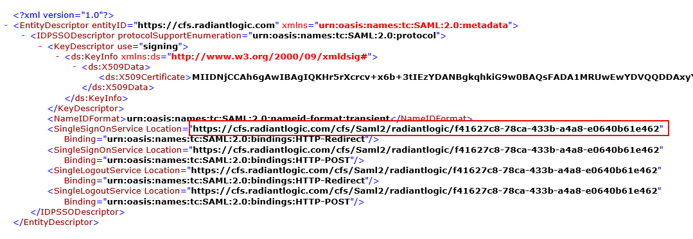

The relevant information is the CFS application endpoint for single sign on and single sign out service. It should be look like this:
_https://<CFS_ADDRESS>/cfs/Saml2/<TENANT>/<RP_ID>_

We need to retrieve the Certificate that will be used to sign the SAML 2 token. To get it, click on _Dashboard_ then _Certificate_ and open the certificate used for the tenant. Save this certificate file into the client application folder **App_Data** using the name **certificate.cer**. This is the default location of the certificate. You can change the location of this file in the next step.

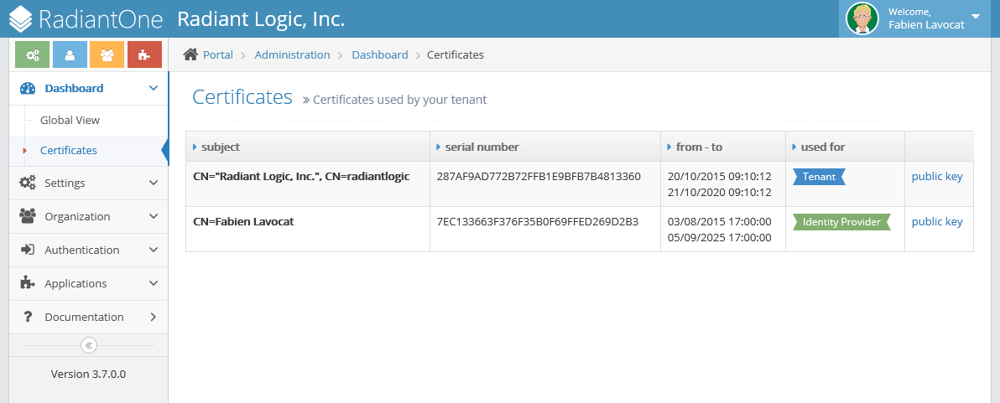

## Configure the Client Application

First, open your web application in Visual Studio and open the **_web.config_** file at the root of the application. At the **_audienceUris_** section replace audienceUris value by the address of the web application:

```sh
  <audienceUris mode="Always">
    <add value="http://CLIENT_WEB_APP_ADDRESS" />
  </audienceUris>
```

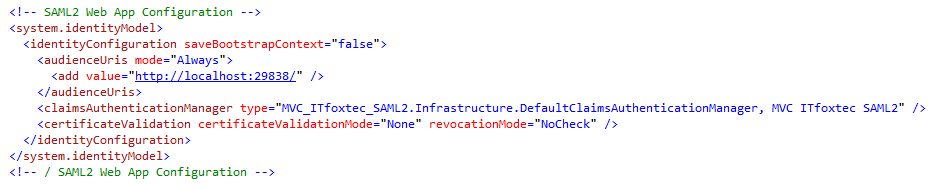

Then, open the **_Configuration.cs_** file at the root of the application and replace the CFS endpoint constant by the address of your CFS application endpoint for single sign on and single sign out service (the value in the CFS Metadata File). Replace the Issuer value with the address of your CFS (the same as the Issuer field during the CFS configuration). You can change here, the default path to read the certificate.

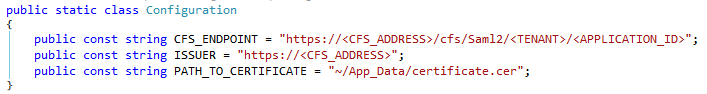

## Run the Client Application

Then, run the application and click on the **_Claims_** link at the top of the screen.

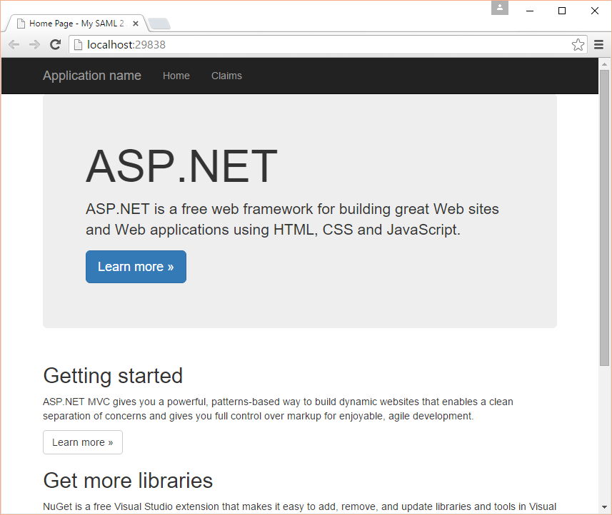

You should be redirected to CFS. Authenticate (if you are not already authenticated) and you will be redirected back to the application.


You will see the list of claims contained in the SAML token.

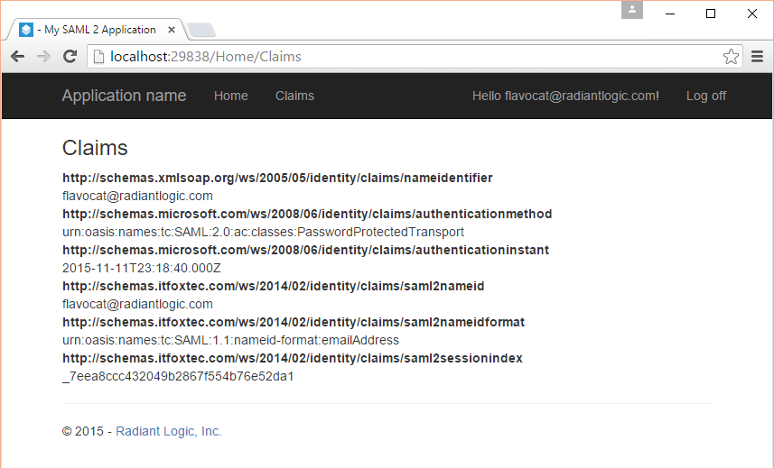
