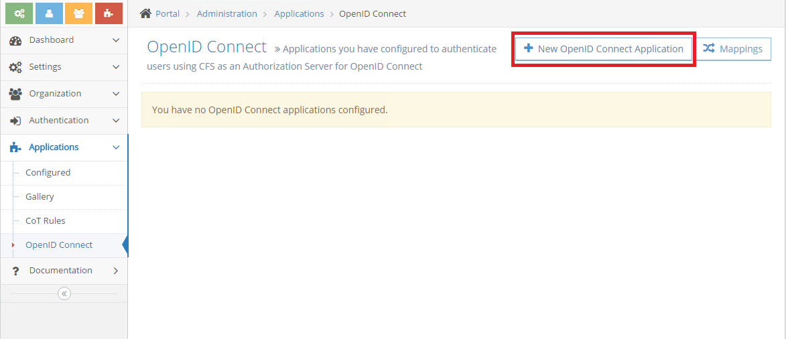
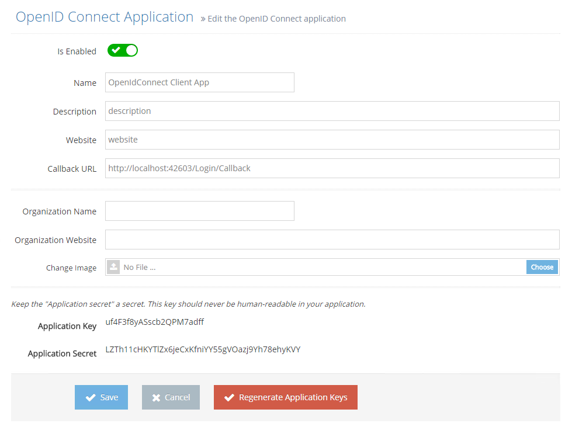
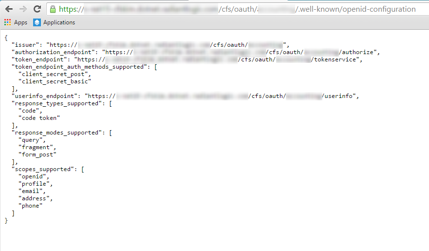
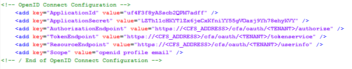
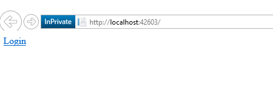
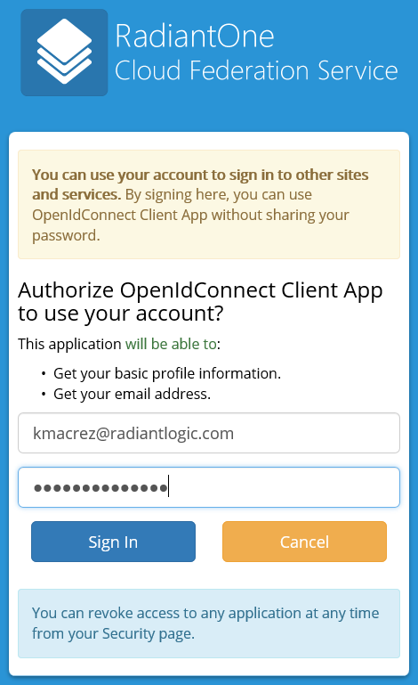
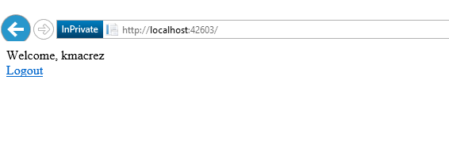

## Introduction

This project is written in C# with the .NET Framework 4.5.2. It is intended for developers who want to add OpenID Connect authentication to their ASP.NET web application. This documentation will explain how to configure Cloud Federation Service (CFS) to authenticate users for this web application. This project uses the DotNetOpenAuth library (https://github.com/DotNetOpenAuth/DotNetOpenAuth).

## Configure CFS
First, login as a Tenant Administrator in CFS and create a new OpenID Connect Application.



Check the _Is Enable_ checkbox and enter a _Name_ and the _Callback URL_ which is the address of your application endpoint where CFS send the authorization code after authentication. Only those 2 fields are relevant for the configuration but CFS requires also a value for the _Description_ field and the _Website_ field.



Copy the _Application Key_ and _Application Secret_ values, it will be used later when configuring the application.  
Also needed are the OpenIdConnect endpoints, which can be found in the form of JSON values, accessing this URL : 
```sh
  https://<CFS_ADDRESS>/cfs/oauth/<TENANT>/.well-known/openid-configuration"
```


## Configure the Client Application

Open your web application in Visual Studio and open the file web.config at the root of the web application. Locate the _<!-- OpenID Connect Configuration -->_ section. 

Replace the **_ApplicationId_** with the _Application Key_ from CFS.  
Replace the **_ApplicationSecret_** with the _Application Secret_ from CFS.  
Replace the **_AuthorizationEndpoint_** with the _authorization_endpoint_ value from the JSON configuration endpoint.  
Replace the **_TokenEndpoint_** with the _token_endpoint_ value from the JSON configuration endpoint.  
Replace the **_ResourceEndpoint_** with the _userinfo_endpoint_ value from the JSON configuration endpoint.  
The **_Scope_** values basically determines which claims will be sent back from CFS. The _openid_ value is the only required.



Then, run the application and click on the _login_ link at the top of the screen.



The application should be redirected to the CFS authorization endpoint. Enter your username and password to authorize the OpenIdConnect client application to access the scope information (here, the profile and email scope).



You will be redirected back to the application authenticated and the application will access to the list of attributes defined by the scope.

