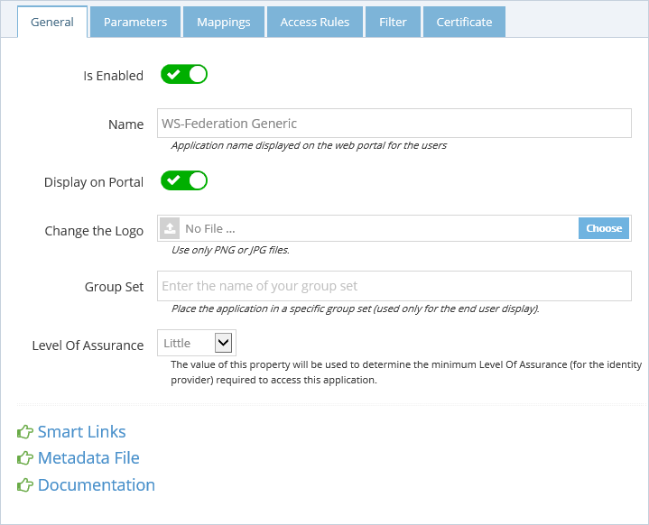
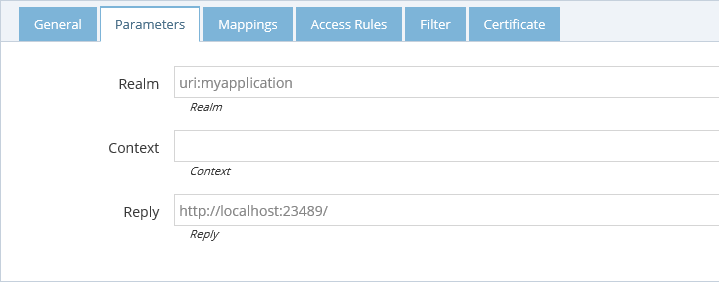
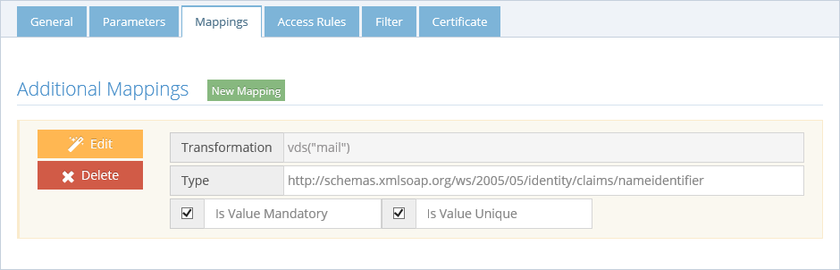
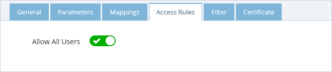
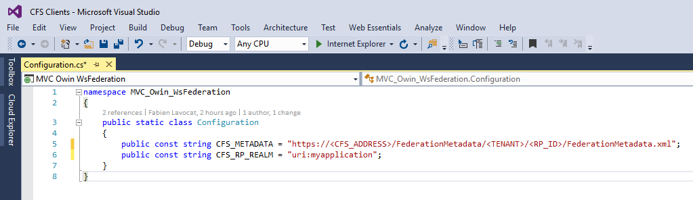
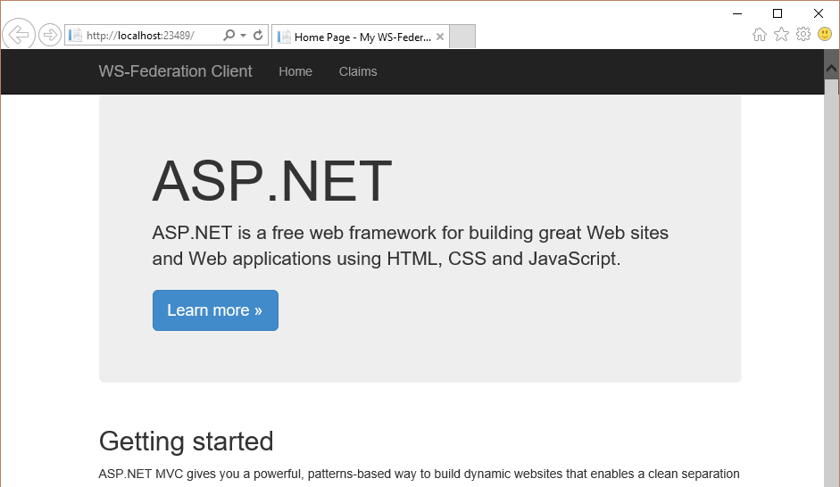
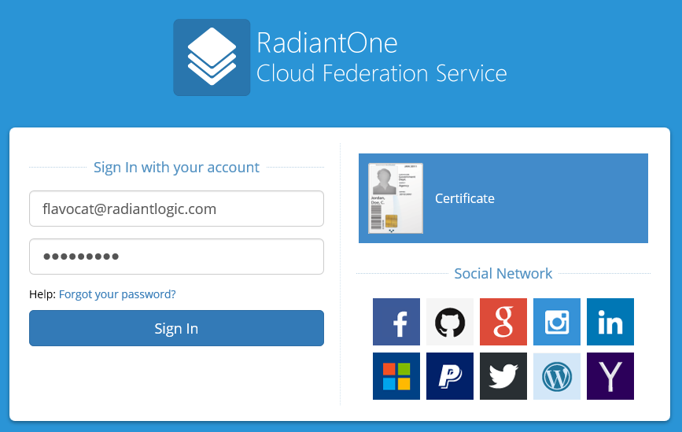
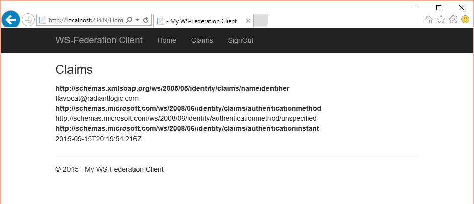

## Introduction

This project is written in C# with the .NET Framework 4.5.2. It is intended for developers who want to add WS-Federation authentication to their ASP.NET MVC web application and using the OWIN framework. This documentation will explain how to configure Cloud Federation Service (CFS) to authenticate users for this web application.

## Configure CFS

First, login as a Tenant Administrator in CFS and create a new Generic Wd-Federation application.

In the _General_ tab, enable your application and provide a name.

In the _Parameters_ tab, enter a **Realm** to identify your web application in CFS. Enter the address of your application in the parameter **Reply**.

In the _Mappings_ tab, enter the list of claims you want to send to your web application. In the example bellow I will send the email address from VDS into the claim _http://schemas.xmlsoap.org/ws/2005/05/identity/claims/nameidentifier_

In the _Access Rules_ tab, allow the application to anyone. 

## Configure OWIN

Open your web application in Visual Studio and open the file _Configuration.cs_ at the root of the web application. Replace the Metadata constant with the link to your application metadata in CFS. And use the same Realm you're set in CFS.

Then, run the application and click on the **Claims** link at the top of the screen.

You should be redirected to CFS. Do your authentication (if you are not already authenticated) and you will be redirected back to the application.

You will see the list of claims contained in the WS-Federation token.

